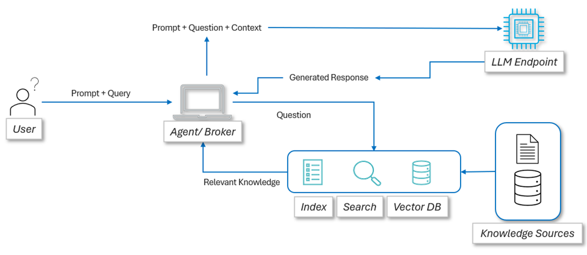

# Powering Sustainable Futures: Unleashing RAG AI with Microsoft Fabric for Energy Management

RAG AI on MS Fabric: Building Knowledge-Powered AI Solutions
In today's fast-paced digital landscape, businesses have abundant data, but they lack meaningful insights. Large Language Models (LLMs) are plenty and their capabilities abound, and still, they often struggle with outdated information, or they lack context-specific knowledge. 
RAG or Retrieval-Augmented-Generation, aims to solve this quandary. This approach bridges the gap between language understanding and your company's unique information ecosystem. RAG is more of a pattern than a technology by itself, and naturally it needs a framework or platform to run with. This is where Microsoft Fabric enters the picture. With Fabric's robust capabilities, we can build RAG solutions that transform how organizations interact with their data. Whether you're looking to create an intelligent chatbot for customer service, a powerful research assistant for your team, or a dynamic knowledge management system, RAG AI on Microsoft Fabric opens a whole new set of possibilities!

Run the .ipynb file in this repository in your Fabric environment as a starter to begin your RAG AI journey in Microsoft Fabric!
For the exact same results as the code, upload following report files to your Microsoft Fabric OneLake Lakehouse:
1. 2024 Report: https://cdn-dynmedia-1.microsoft.com/is/content/microsoftcorp/microsoft/msc/documents/presentations/CSR/Microsoft-2024-Environmental-Sustainability-Report.pdf
2. 2022 Report: https://cdn-dynmedia-1.microsoft.com/is/content/microsoftcorp/microsoft/msc/documents/presentations/CSR/2022-Environmental-Sustainability-Report.pdf
3. 2021 Report: https://cdn-dynmedia-1.microsoft.com/is/content/microsoftcorp/microsoft/msc/documents/presentations/CSR/2021-Environmental-Sustainability-Report.pdf

## Understanding RAG AI

Retrieval Augmented Generation (RAG) is an AI framework that enhances the capabilities of large language models (LLMs) by grounding them with external, up-to-date information. The architecture of RAG addresses the fundamental limitations of traditional LLMs, which typically rely on static training data and can produce responses that are outdated or inaccurate. 
Let's go through the components of RAG AI:
### Retrieval:
The retrieval component is responsible for finding relevant information from a knowledge base or external data source in response to a user query. It involves:
1.	Query Encoding: The user's input is transformed into a numerical representation (embedding) using models like BERT or GPT.
2.	Vector Search: The system searches through a vector database to find documents or text chunks that are semantically similar to the query.
3.	Ranking and Filtering: Retrieved information is ranked based on relevance, typically selecting the top N most relevant documents

### Augmentation:
The augmentation component enhances the retrieved information and prepares it for the generation phase:
1.	Contextual Embedding: Retrieved documents are converted into numerical embeddings to allow the model to process their content effectively
2.	Fusion: The retrieved information is combined with the original query to create a more comprehensive prompt for the language model
3.	Prompt Engineering: Techniques are applied to effectively communicate the augmented context to the LLM

### Generation:
The generation component uses a large language model (LLM) to produce a response based on the augmented prompt:
1.	Context Processing: The LLM analyzes the augmented prompt, which includes both the original query and the retrieved information
2.	Response Generation: The model generates an answer that leverages both its pre-trained knowledge, and the additional context provided

### Embedding Model:
An embedding model converts text data into numerical vector representations, enabling efficient storage and retrieval of information in vector databases. 
1.	Document Embedding: Converts external documents into vector representations for storage in the vector database
2.	Query Embedding: Transforms user queries into vector form for similarity matching

### Vector Database:
1.	Storage: Holds the embedded representations of documents or other data sources
2.	Retrieval: Enables fast and efficient similarity searches to find relevant information

### Re-ranker:
Some RAG systems include a re-ranker component that evaluates and scores the retrieved documents based on their relevance to the original query, helping to prioritize the most pertinent information for augmentation.
1.	Score-based Re-rankers: Aggregate and reorder candidate lists using weighted scoring or Reciprocal Rank Fusion
2.	Neural Network-based Re-rankers: Use deep learning to analyze query-document relevance and refine search results
3.	Relevance Scoring: Provides more precise relevance scores, helping to filter out less relevant information before it reaches the LLM
Let's look at the RAG AI pattern with a simple block diagram:
 
